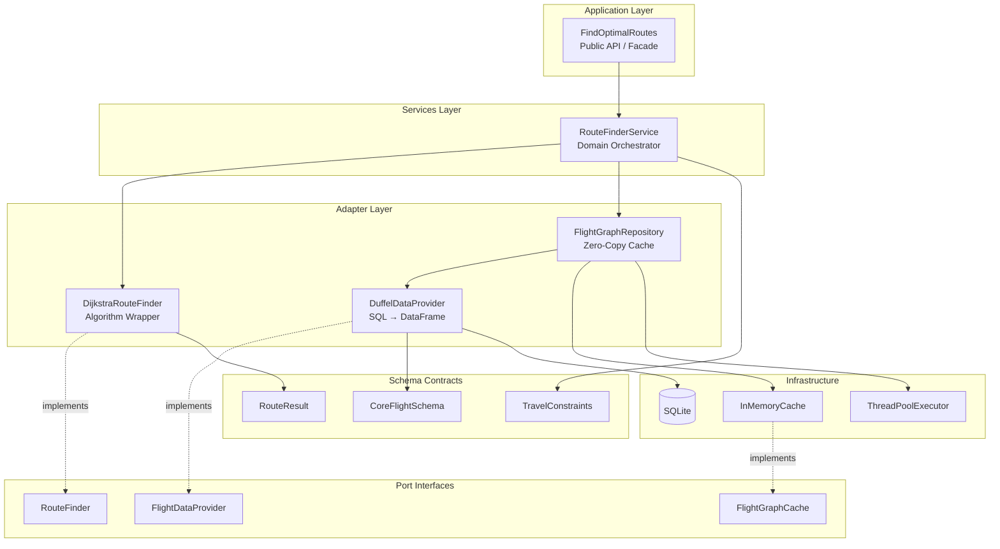

# Flight Router

A high-performance, multi-criteria flight routing engine built on vectorized DataFrame operations and zero-copy memory patterns.

## Module Overview

This module implements a Pareto-optimal route finder for multi-city flight itineraries. It wraps a legacy Dijkstra-based algorithm with a modern, production-grade architecture featuring:

- **Schema-First Design**: Pandera-validated DataFrames as the primary data structure
- **Zero-Copy Data Flow**: Index-based access patterns eliminating redundant memory allocation
- **Non-Blocking Operations**: Double-buffer refresh enabling zero-downtime cache updates
- **Immutability Guardrails**: Protection against accidental mutation of shared state

The algorithm finds **round-trip routes** that start from an origin, visit all required cities, and return to the origin, optimizing for both cost and time (Pareto frontier).

---

## Quick Start

For an interactive tutorial, see the Jupyter notebook:

📓 **[examples/01_getting_started.ipynb](examples/01_getting_started.ipynb)**

The notebook covers:
- Database discovery (available airports and date ranges)
- Single and multi-city route searches
- Route detail inspection with flight times
- Performance benchmarking
- Raw epoch-based API for advanced use cases

---

## Architecture



### Layer Responsibilities

| Layer | Purpose | Key Classes |
|-------|---------|-------------|
| **Application** | Public API, dependency injection, lifecycle management | `FindOptimalRoutes` |
| **Services** | Domain orchestration, constraint validation, metrics logging | `RouteFinderService` |
| **Adapters** | Concrete implementations of port interfaces | `DuffelDataProvider`, `DijkstraRouteFinder`, `FlightGraphRepository` |
| **Ports** | Abstract interfaces (ABCs/Protocols) for dependency inversion | `FlightDataProvider`, `RouteFinder`, `FlightGraphCache` |
| **Schemas** | Data contracts using Pandera DataFrameModels and frozen dataclasses | `CoreFlightSchema`, `TravelConstraints`, `RouteResult` |

---

## Public API Usage

### Basic Usage

```python
from datetime import datetime
from src.flight_router.application import FindOptimalRoutes

# Context manager ensures clean shutdown of background threads
with FindOptimalRoutes() as router:
    # Find round-trip routes: WAW -> LHR -> WAW
    results = router.search(
        origin="WAW",
        destinations={"LHR"},
        departure_date=datetime(2026, 7, 1),
        max_stops=2,
        max_price=500.0,
    )

    for route in results:
        print(f"Route: {' -> '.join(route.route_cities)}")
        print(f"Cost: ${route.total_cost:.2f}")
        print(f"Duration: {route.total_time / 60:.1f} hours")
        print(f"Segments: {route.num_segments}")
        print()
```

### Custom Configuration

```python
from datetime import timedelta
from src.flight_router.application import FindOptimalRoutes
from src.flight_router.adapters.algorithms.dijkstra_adapter import DijkstraRouteFinder

# Custom database path and cache TTL
router = FindOptimalRoutes(
    db_path="/path/to/custom/flights.db",
    cache_ttl=timedelta(minutes=30),
    route_finder=DijkstraRouteFinder(require_defensive_copy=True),
)

# Check available airports
airports = router.get_available_airports()
print(f"Available: {len(airports)} airports")

# Check direct route existence
if router.has_route("WAW", "LHR"):
    print("Direct WAW -> LHR exists")

# Manual shutdown (if not using context manager)
router.shutdown()
```

### Low-Level API (Epoch Minutes)

```python
# For performance-critical applications, use raw epoch-based time
results = router.search_raw(
    start_city="WAW",
    required_cities={"LHR", "CDG"},
    t_min=1325376.0,  # Minutes since 2024-01-01
    t_max=1330000.0,
)

# Utility conversions
minutes = FindOptimalRoutes.datetime_to_epoch_minutes(datetime(2026, 7, 15, 10, 0))
dt = FindOptimalRoutes.epoch_minutes_to_datetime(minutes)
```

---

## Key Architectural Concepts

### 1. Schema-First Design

**Problem**: Traditional OOP creates thousands of `Flight` objects only to marshal them back to DataFrame for the algorithm.

**Solution**: Pandera-validated DataFrames flow through all layers without object creation.

```python
# Schema defines the contract
class CoreFlightSchema(pa.DataFrameModel):
    departure_airport: Series[str] = pa.Field(nullable=False)
    arrival_airport: Series[str] = pa.Field(nullable=False)
    dep_time: Series[float] = pa.Field(ge=0)
    arr_time: Series[float] = pa.Field(ge=0)
    price: Series[float] = pa.Field(ge=0)

    class Config:
        strict = False  # CRITICAL: allows extra columns to pass through
        coerce = True
```

**Why `strict=False`?**

This enables **schema extensibility**. The `CoreFlightSchema` defines the minimum required columns for the algorithm. Additional columns (carrier_name, baggage_included, etc.) pass through untouched:

```python
# Extended schema inherits core validation
class ExtendedFlightSchema(CoreFlightSchema):
    carrier_code: Series[str] = pa.Field(nullable=True)
    carrier_name: Series[str] = pa.Field(nullable=True)
    baggage_included: Series[float] = pa.Field(nullable=True, ge=0)
```

Adding a new column requires:
1. Add field to `ExtendedFlightSchema`
2. Update SQL query in `DuffelDataProvider`
3. **No changes to algorithm or services** - they use `CoreFlightSchema`

---

### 2. Zero-Copy Memory Patterns

**Problem**: `pd.concat()` or `groupby().get_group()` per request duplicates memory.

**Solution**: Pre-sorted DataFrame with index-based `iloc` slicing returns **views**, not copies.

```python
@dataclass(frozen=True)
class CityIndex:
    """Index range for O(1) city-based access."""
    start: int  # Inclusive
    end: int    # Exclusive

class CachedFlightGraph:
    flights_df: pd.DataFrame      # Sorted by departure_airport
    city_index: Dict[str, CityIndex]  # city -> (start, end)

    def get_flights_for_city(self, city: str) -> pd.DataFrame:
        if city not in self.city_index:
            return _get_empty_df(self.flights_df.columns)  # Singleton!
        idx = self.city_index[city]
        return self.flights_df.iloc[idx.start:idx.end]  # VIEW, not copy
```

**Memory comparison (100k flights, 100 airports):**

| Approach | Memory |
|----------|--------|
| `groupby()` dict of copies | ~200MB (2x original) |
| `CityIndex` with iloc views | ~100MB + 800 bytes |

**Implementation detail**: The index is built using **numpy vectorized operations** which release the GIL, enabling concurrent access during background refresh:

```python
def build_city_index(df: pd.DataFrame) -> Dict[str, CityIndex]:
    cities = df["departure_airport"].values  # numpy array
    # Vectorized boundary detection - releases GIL
    change_mask = np.concatenate([[True], cities[1:] != cities[:-1]])
    change_indices = np.where(change_mask)[0]
    # ... build index from boundaries
```

---

### 3. Concurrency: Double-Buffer Refresh

**Problem**: Lock-based cache refresh blocks readers during data reload (potential 5+ second latency).

**Solution**: **Double-buffer pattern** - readers always get current data, writers build new data in background then atomic swap.

```
Timeline:
0s:   Request A arrives → returns current graph (fast)
0s:   TTL expired → background thread starts building new graph
1s:   Request B arrives → returns current graph (fast, stale data OK)
3s:   Request C arrives → returns current graph (fast)
5s:   Background build completes → atomic pointer swap
5s:   Request D arrives → returns NEW graph (fast)
```

**Code pattern**:

```python
class FlightGraphRepository:
    def get_graph(self) -> CachedFlightGraph:
        cached = self._cache.get()
        if cached is not None:
            # Fast path: return immediately, maybe trigger background refresh
            if self._cache.is_stale:
                self._trigger_background_refresh()  # Non-blocking
            return cached
        # Cold start: must block for first load
        with self._refresh_lock:
            self._do_refresh()
        return self._cache.get()

    def _background_refresh(self) -> None:
        new_graph = self._build_graph()
        self._cache.set(new_graph)  # Atomic swap
```

**Guarantee**: After cold start, `get_graph()` **never blocks**.

---

### 4. Immutability Guardrails

**Problem**: The `CachedFlightGraph` holds a singleton DataFrame shared across:
- Multiple concurrent requests (threads)
- Background refresh thread
- Potentially multiple workers (future shared memory)

If any code mutates this DataFrame (e.g., `df['visited'] = True`), it corrupts state for all users.

**Solution**: Enforce immutability at adapter boundary.

```python
def make_immutable(df: pd.DataFrame) -> pd.DataFrame:
    """Lock underlying numpy arrays to prevent mutation."""
    for col in df.columns:
        arr = df[col].values
        if isinstance(arr, np.ndarray) and arr.flags.writeable:
            arr.flags.writeable = False
    return df

# In DijkstraRouteFinder:
def find_routes(self, graph: CachedFlightGraph, ...) -> List[RouteResult]:
    flights_df = graph.flights_df
    if self._require_copy:
        flights_df = make_defensive_copy(flights_df)  # O(n) fallback
    else:
        flights_df = make_immutable(flights_df)  # Zero-copy, raises on mutation

    return dijkstra(flights_df, ...)
```

**Error handling**: If legacy algorithm attempts mutation:

```python
try:
    result = dijkstra(flights_df, ...)
except ValueError as e:
    if "read-only" in str(e):
        raise RuntimeError(
            "Algorithm attempted to mutate shared DataFrame. "
            "Enable require_defensive_copy=True or fix algorithm."
        ) from e
```

---

## Developer Guide

### Extending the Schema

To add a new column (e.g., `terminal_transfer_time`):

1. **Add to ExtendedFlightSchema** (`schemas/flight.py`):
   ```python
   class ExtendedFlightSchema(CoreFlightSchema):
       # ... existing fields ...
       terminal_transfer_time: Series[float] = pa.Field(nullable=True, ge=0)
   ```

2. **Update SQL query** (`adapters/data_providers/duffel_provider.py`):
   ```python
   query = """
       SELECT
           fs.origin_iata,
           fs.dest_iata,
           -- ... existing columns ...
           fs.terminal_transfer_time  -- NEW
       FROM flights_static fs
       JOIN flight_quotes fq ON fs.route_id = fq.flight_static_id
   """
   ```

3. **Map in transform** (`_transform_to_schema`):
   ```python
   result["terminal_transfer_time"] = df["terminal_transfer_time"].astype(float)
   ```

4. **No changes needed** in:
   - `RouteFinderService` (uses `CoreFlightSchema`)
   - `DijkstraRouteFinder` (passes through extra columns)
   - `FlightGraphRepository` (schema-agnostic)

### Adding a New Algorithm

1. **Implement RouteFinder interface** (`adapters/algorithms/my_algorithm.py`):
   ```python
   class MyRouteFinder(RouteFinder):
       def find_routes(
           self,
           graph: CachedFlightGraph,
           start_city: str,
           required_cities: set[str],
           t_min: float,
           t_max: float,
       ) -> List[RouteResult]:
           flights_df = make_immutable(graph.flights_df)
           # ... your algorithm ...
           return results

       @property
       def name(self) -> str:
           return "My Custom Algorithm"
   ```

2. **Inject via FindOptimalRoutes**:
   ```python
   router = FindOptimalRoutes(
       route_finder=MyRouteFinder(),
   )
   ```

### Running Tests

```bash
# Unit tests only (fast, ~1 second)
python -m pytest --ignore=tests/integration -v

# Integration tests (requires database, ~20 minutes)
python -m pytest tests/integration -v

# Full suite
python -m pytest -v

# With coverage
python -m pytest --cov=src/flight_router --cov-report=html
```

### Performance Profiling

```python
import logging
logging.basicConfig(level=logging.DEBUG)

# RouteFinderService logs timing breakdown:
# INFO: Route search completed: 5 results in 1234.567ms (graph: 0.123ms, algo: 1234.000ms)
```

---

## Configuration Reference

| Parameter | Default | Description |
|-----------|---------|-------------|
| `db_path` | `Duffel_api/flights.db` | Path to SQLite database |
| `cache_ttl` | 1 hour | Cache time-to-live before background refresh |
| `require_defensive_copy` | `False` | If `True`, copy DataFrame before algorithm (slower, safer) |
| `auto_refresh` | `True` | Automatically refresh cache when stale |

---

## Future Enhancements (Phase 2+)

### Shared Memory Cache

For multi-worker deployments (4 Gunicorn workers × 2GB = 8GB wasted), the `FlightGraphCache` protocol supports:

- **ArrowPlasmaCache**: Apache Arrow shared memory store
- **MmapCache**: Memory-mapped Parquet files with OS page sharing

Migration requires no code changes - inject alternative cache implementation:

```python
cache = MmapCache(Path("/dev/shm/flights.parquet"), ttl=timedelta(hours=1))
repo = FlightGraphRepository(data_provider, cache)
```

### Algorithm Optimization (Phase 3.5)

Current: Dijkstra internally calls `build_flights_by_city()` - redundant O(n) work since we have `CityIndex`.

Future: Pass pre-built dict from `CityIndex` to skip internal groupby.

---

## Troubleshooting

### "read-only" ValueError

**Cause**: Algorithm attempted to mutate immutable DataFrame.

**Fix**: Either fix the algorithm to not mutate, or enable defensive copy:
```python
route_finder = DijkstraRouteFinder(require_defensive_copy=True)
```

### GraphNotInitializedError on cold start

**Cause**: Database file not found or corrupted.

**Fix**: Verify `db_path` points to valid SQLite file:
```python
from pathlib import Path
assert Path("Duffel_api/flights.db").exists()
```

### Empty results for valid query

**Causes**:
1. Time window too narrow - flights exist but not in `[t_min, t_max]`
2. No return flight - algorithm requires round-trip routes
3. `max_stops` too restrictive

**Debug**:
```python
# Check available routes
graph = router._graph_repo.get_graph()
print(f"Routes from WAW: {[r for r in graph.routes if r[0] == 'WAW']}")
```
