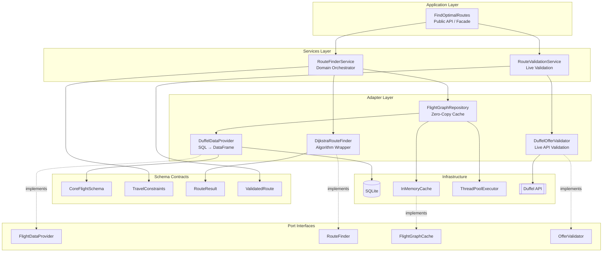

# Flight Router

A high-performance, multi-criteria flight routing engine built on vectorized DataFrame operations and zero-copy memory patterns.

## Overview

This module implements a **Pareto-optimal route finder** for multi-city flight itineraries. It finds round-trip routes that start from an origin, visit all required destinations, and return to the origin - optimizing for both **cost** and **time** simultaneously.

### Key Features

| Feature | Benefit |
|---------|---------|
| **Schema-First Design** | Pandera-validated DataFrames - no object marshaling overhead |
| **Zero-Copy Data Flow** | CityIndex with `iloc` slicing returns views, not copies |
| **Optimized Algorithm** | FlightRecord + numpy arrays - **6-7x faster** than naive iteration |
| **Non-Blocking Cache** | Double-buffer refresh - zero-downtime updates |
| **Immutability Guardrails** | Shared DataFrame protected from accidental mutation |

### Performance

| Dataset | Single Destination | Multi-City (2 dest) |
|---------|-------------------|---------------------|
| ~90k flights | ~3-5 seconds | ~15-30 seconds |
| ~250k flights | ~15-20 seconds | ~60-90 seconds |

---

## Quick Start

### Interactive Tutorial

📓 **[examples/01_getting_started.ipynb](examples/01_getting_started.ipynb)**

The notebook includes a curated demo dataset (~89k flights) and covers:
- Database discovery (airports, date ranges, carriers)
- Single and multi-city route searches
- Route detail inspection
- Performance benchmarking

### Minimal Example

```python
from datetime import datetime
from src.flight_router.application import FindOptimalRoutes

with FindOptimalRoutes() as router:
    results = router.search(
        origin="WAW",
        destinations={"LHR"},
        departure_date=datetime(2026, 7, 13),
        return_date=datetime(2026, 7, 19),
    )

    for route in results[:3]:
        print(f"{' -> '.join(route.route_cities)}")
        print(f"  Cost: €{route.total_cost:.2f} | Duration: {route.total_time / 60:.1f}h")
```

### Custom Configuration

```python
from datetime import timedelta
from src.flight_router.application import FindOptimalRoutes

router = FindOptimalRoutes(
    db_path="path/to/flights.db",
    cache_ttl=timedelta(minutes=30),
)

# Discovery
airports = router.get_available_airports()
has_direct = router.has_route("WAW", "LHR")

# Always shutdown when not using context manager
router.shutdown()
```

---

## API Reference

### FindOptimalRoutes

```python
FindOptimalRoutes(
    db_path: str | Path = "Duffel_api/flights.db",
    cache_ttl: timedelta = timedelta(hours=1),
    route_finder: RouteFinder = DijkstraRouteFinder(),
)
```

**Methods:**

| Method | Description |
|--------|-------------|
| `search(origin, destinations, departure_date, return_date=None)` | Find Pareto-optimal routes |
| `search_raw(start_city, required_cities, t_min, t_max)` | Low-level epoch-based search |
| `get_available_airports()` | Get all airport codes in database |
| `has_route(origin, destination)` | Check if direct route exists |
| `shutdown()` | Release resources (auto-called by context manager) |

**Utility:**

| Method | Description |
|--------|-------------|
| `datetime_to_epoch_minutes(dt)` | Convert datetime to minutes since 2024-01-01 |
| `epoch_minutes_to_datetime(minutes)` | Convert epoch minutes back to datetime |

### RouteResult

```python
@dataclass(frozen=True)
class RouteResult:
    route_id: int
    segments: tuple[RouteSegment, ...]
    visited_cities: frozenset[str]

    # Computed properties
    total_cost: float       # Sum of segment prices
    total_time: float       # End time - start time (minutes)
    route_cities: list[str] # Ordered city sequence
```

---

## Validation API

Live validation confirms cached route availability and pricing against the Duffel API before booking.

### RouteValidationService

```python
from src.flight_router.services import RouteValidationService
from src.flight_router.adapters.validators import DuffelOfferValidator

validator = DuffelOfferValidator(api_token="your_duffel_token")
service = RouteValidationService(validator)
```

**Methods:**

| Method | Description |
|--------|-------------|
| `validate_route(route, departure_date)` | Validate single route (async) |
| `validate_routes(routes, departure_date, validate_top_n=None)` | Batch validation with optional limit |
| `validate_route_on_demand(route, departure_date)` | Lazy validation for user-selected routes |

### ValidationStatus

| Status | Meaning | Bookable? |
|--------|---------|-----------|
| `CONFIRMED` | Price within ±5% tolerance | ✅ Yes |
| `PRICE_CHANGED` | Price differs by >5%, show warning | ✅ Yes |
| `UNAVAILABLE` | Flight not found in live search | ❌ No |
| `API_ERROR` | Validation failed, retry later | ❌ No |

### ValidatedRoute

```python
@dataclass(frozen=True)
class ValidatedRoute:
    route: RouteResult
    validation: Optional[RouteValidation]

    # Computed properties
    is_validated: bool      # True if validation was performed
    is_bookable: bool       # True for CONFIRMED/PRICE_CHANGED
    total_price: float      # Live price if available, else cached
    price_confidence: str   # "high" | "medium" | "low" | "unvalidated"
```

### Usage Example

```python
from datetime import date

# Validate top 3 routes from search results
validated = await service.validate_routes(
    routes=search_results,
    departure_date=date(2026, 7, 15),
    validate_top_n=3,
)

for result in validated:
    if result.is_bookable:
        print(f"Route {result.route.route_id}: €{result.total_price:.2f}")
        print(f"  Confidence: {result.price_confidence}")
        print(f"  Status: {result.validation.status.value}")
```

---

## Configuration

### FindOptimalRoutes Parameters

| Parameter | Default | Description |
|-----------|---------|-------------|
| `db_path` | `Duffel_api/flights.db` | SQLite database path |
| `cache_ttl` | 1 hour | Time before background refresh triggers |
| `require_defensive_copy` | `False` | Copy DataFrame before algorithm (slower, safer) |

### ValidationConfig Parameters

| Parameter | Default | Description |
|-----------|---------|-------------|
| `price_confirmed_threshold` | 5.0 | Max % price change for CONFIRMED status |
| `price_changed_threshold` | 25.0 | Max % change before UNAVAILABLE |
| `min_confidence_threshold` | 30.0 | Min confidence score (0-100) to accept match |
| `max_concurrent_requests` | 3 | Parallel API request limit |
| `request_timeout_ms` | 10000 | Per-request timeout in milliseconds |
| `max_retries` | 5 | Retry attempts on rate limit (429) |
| `backoff_multiplier` | 2.0 | Exponential backoff factor |

```python
from src.flight_router.schemas.validation import ValidationConfig

config = ValidationConfig(
    price_confirmed_threshold=3.0,  # Stricter price tolerance
    max_concurrent_requests=5,       # More parallel requests
)
validator = DuffelOfferValidator(api_token="...", config=config)
```

---

## Running Tests

```bash
# Unit tests (~1 second)
python -m pytest tests/ --ignore=tests/integration -v

# Integration tests (~3-5 minutes with demo dataset)
python -m pytest tests/integration -v

# Performance benchmarks
python -m pytest tests/performance --benchmark-only

# Full suite with coverage
python -m pytest --cov=src/flight_router --cov-report=html
```

---

## Troubleshooting

| Issue | Cause | Solution |
|-------|-------|----------|
| `Airport 'XXX' not found` | Airport not in dataset | Use `get_available_airports()` to check |
| `Found 0 routes` | Date range mismatch | Check database date range (demo: July 13-19, 2026) |
| `FileNotFoundError` | Wrong db_path | Verify database file exists |
| `read-only ValueError` | Algorithm mutation attempt | Set `require_defensive_copy=True` |

---

# Architecture Deep Dive

This section is for developers who need to understand, extend, or debug the module internals.

## System Architecture



### Layer Responsibilities

| Layer | Purpose | Key Classes |
|-------|---------|-------------|
| **Application** | Public API, dependency injection, lifecycle management | `FindOptimalRoutes` |
| **Services** | Domain orchestration, constraint validation, live validation | `RouteFinderService`, `RouteValidationService` |
| **Adapters** | Concrete implementations of port interfaces | `DuffelDataProvider`, `DijkstraRouteFinder`, `FlightGraphRepository`, `DuffelOfferValidator` |
| **Ports** | Abstract interfaces (ABCs/Protocols) for dependency inversion | `FlightDataProvider`, `RouteFinder`, `FlightGraphCache`, `OfferValidator` |
| **Schemas** | Data contracts using Pandera DataFrameModels and frozen dataclasses | `CoreFlightSchema`, `TravelConstraints`, `RouteResult`, `ValidatedRoute` |

---

## Core Design Patterns

### 1. Schema-First Design

**Problem**: Traditional OOP creates thousands of `Flight` objects only to marshal them back to DataFrame for the algorithm.

**Solution**: Pandera-validated DataFrames flow through all layers without object creation.

```python
class CoreFlightSchema(pa.DataFrameModel):
    departure_airport: Series[str] = pa.Field(nullable=False)
    arrival_airport: Series[str] = pa.Field(nullable=False)
    dep_time: Series[float] = pa.Field(ge=0)
    arr_time: Series[float] = pa.Field(ge=0)
    price: Series[float] = pa.Field(ge=0)

    class Config:
        strict = False  # Allows extra columns to pass through
        coerce = True
```

**Why `strict=False`?** Schema extensibility. `CoreFlightSchema` defines minimum required columns. Additional columns (carrier_name, baggage_included, etc.) pass through untouched.

---

### 2. Zero-Copy CityIndex

**Problem**: `pd.concat()` or `groupby().get_group()` per request duplicates memory.

**Solution**: Pre-sorted DataFrame with index-based `iloc` slicing returns **views**, not copies.

```python
@dataclass(frozen=True)
class CityIndex:
    """Index range for O(1) city-based access."""
    start: int  # Inclusive
    end: int    # Exclusive

class CachedFlightGraph:
    flights_df: pd.DataFrame      # Sorted by departure_airport
    city_index: Dict[str, CityIndex]

    def get_flights_for_city(self, city: str) -> pd.DataFrame:
        if city not in self.city_index:
            return _get_empty_df(self.flights_df.columns)  # Singleton!
        idx = self.city_index[city]
        return self.flights_df.iloc[idx.start:idx.end]  # VIEW, not copy
```

**Memory comparison (100k flights, 100 airports):**

| Approach | Memory |
|----------|--------|
| `groupby()` dict of copies | ~200MB (2x original) |
| `CityIndex` with iloc views | ~100MB + 800 bytes |

---

### 3. FlightRecord Optimization

**Problem**: `df.iterrows()` creates a `pd.Series` (~2KB) per row. With 100k flights × 60 iterations = 6M Series objects.

**Solution**: Lightweight `FlightRecord` dataclass with `__slots__`.

```python
@dataclass(slots=True)
class FlightRecord:
    """~200 bytes vs ~2KB for pd.Series - 10x smaller"""
    idx: int
    dep_time: float
    arr_time: float
    price: float
    arrival_airport: str

    def get(self, key: str, default=None):
        return getattr(self, key, default)
```

**Performance**: 6-7x speedup (e.g., 120s → 17s for FRA origin).

---

### 4. Double-Buffer Refresh

**Problem**: Lock-based cache refresh blocks readers during data reload (5+ second latency).

**Solution**: Readers always get current data, writers build new data in background then atomic swap.

```
Timeline:
0s:   Request A → returns current graph (fast)
0s:   TTL expired → background thread starts building new graph
1s:   Request B → returns current graph (fast, stale data OK)
3s:   Request C → returns current graph (fast)
5s:   Background build completes → atomic pointer swap
5s:   Request D → returns NEW graph (fast)
```

**Guarantee**: After cold start, `get_graph()` **never blocks**.

---

### 5. Immutability Guardrails

**Problem**: The `CachedFlightGraph` holds a singleton DataFrame shared across multiple concurrent requests. Any mutation corrupts state for all users.

**Solution**: Enforce immutability at adapter boundary.

```python
def make_immutable(df: pd.DataFrame) -> pd.DataFrame:
    """Lock underlying numpy arrays to prevent mutation."""
    for col in df.columns:
        arr = df[col].values
        if isinstance(arr, np.ndarray) and arr.flags.writeable:
            arr.flags.writeable = False
    return df
```

If code attempts mutation: `ValueError: assignment destination is read-only`

---

### 6. Live Validation Pattern

**Problem**: Cached flight data becomes stale - prices change, flights sell out, schedules shift. Users see "phantom routes" that fail at booking.

**Solution**: Re-search strategy with confidence scoring validates routes against live Duffel API before presenting to users.

```python
# Validation flow
RouteResult → RouteValidationService → DuffelOfferValidator → ValidatedRoute
                                              ↓
                                      Duffel API (re-search)
                                              ↓
                                      Offer Matching (scoring)
                                              ↓
                                      ValidationStatus + Confidence
```

**Key Design Decisions:**

| Decision | Rationale |
|----------|-----------|
| **Worst-status-wins** | One failed segment = entire route fails |
| **Parallel segment validation** | Validates segments concurrently with semaphore |
| **Confidence scoring** | 10-factor algorithm matches cached vs live offers |
| **Exponential backoff** | Handles Duffel rate limits (429) gracefully |
| **Placeholder detection** | Filters "ZZ" carrier offers (route doesn't exist) |

**Scoring Weights (PoC-validated):**

| Factor | Points | Description |
|--------|--------|-------------|
| Carrier match | +50 | Same airline |
| Hour exact | +30 | Same departure hour |
| Price exact | +30 | Within 5% |
| Non-stop | +20 | No connections |
| Carrier mismatch | -20 | Different airline |
| Hour outside | -30 | >1 hour difference |
| Price outside | -50 | >25% difference |

---

## Developer Guide

### Extending the Schema

To add a new column (e.g., `terminal_transfer_time`):

1. **Add to ExtendedFlightSchema** (`schemas/flight.py`):
   ```python
   terminal_transfer_time: Series[float] = pa.Field(nullable=True, ge=0)
   ```

2. **Update SQL query** (`adapters/data_providers/duffel_provider.py`):
   ```python
   query = """SELECT ..., fs.terminal_transfer_time FROM ..."""
   ```

3. **Map in transform** (`_transform_to_schema`):
   ```python
   result["terminal_transfer_time"] = df["terminal_transfer_time"].astype(float)
   ```

4. **No changes needed** in: `RouteFinderService`, `DijkstraRouteFinder`, `FlightGraphRepository`

---

### Adding a New Algorithm

1. **Implement RouteFinder interface**:
   ```python
   class MyRouteFinder(RouteFinder):
       def find_routes(
           self,
           graph: CachedFlightGraph,
           start_city: str,
           required_cities: set[str],
           t_min: float,
           t_max: float,
       ) -> List[RouteResult]:
           flights_df = make_immutable(graph.flights_df)
           # Your algorithm here...
           return results

       @property
       def name(self) -> str:
           return "My Custom Algorithm"
   ```

2. **Inject via FindOptimalRoutes**:
   ```python
   router = FindOptimalRoutes(route_finder=MyRouteFinder())
   ```

---

## Future Enhancements

### Live Route Validation (Implemented)

Route validation against Duffel API is now available. See [Validation API](#validation-api) section.

### Shared Memory Cache

For multi-worker deployments (4 Gunicorn workers × 2GB = 8GB wasted), the `FlightGraphCache` protocol supports:

- **MmapCache**: Memory-mapped Parquet with OS page sharing
- **ArrowPlasmaCache**: Apache Arrow shared memory store

```python
cache = MmapCache(Path("/dev/shm/flights.parquet"), ttl=timedelta(hours=1))
repo = FlightGraphRepository(data_provider, cache)
```

**Benefit**: 4 workers × 2GB = 2GB total (shared) vs 8GB (copied).
